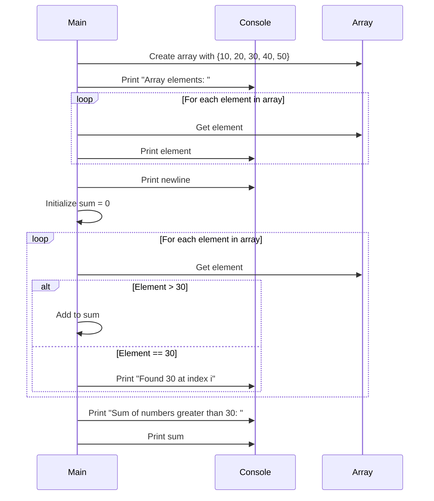

```mermaid
sequenceDiagram
    participant Main
    participant Console
    participant Array

    Main->>Array: Create array with {10, 20, 30, 40, 50}
    Main->>Console: Print "Array elements: "
    loop For each element in array
        Main->>Array: Get element
        Main->>Console: Print element
    end
    Main->>Console: Print newline

    Main->>Main: Initialize sum = 0
    loop For each element in array
        Main->>Array: Get element
        alt Element > 30
            Main->>Main: Add to sum
        else Element == 30
            Main->>Console: Print "Found 30 at index i"
        end
    end

    Main->>Console: Print "Sum of numbers greater than 30: "
    Main->>Console: Print sum
```