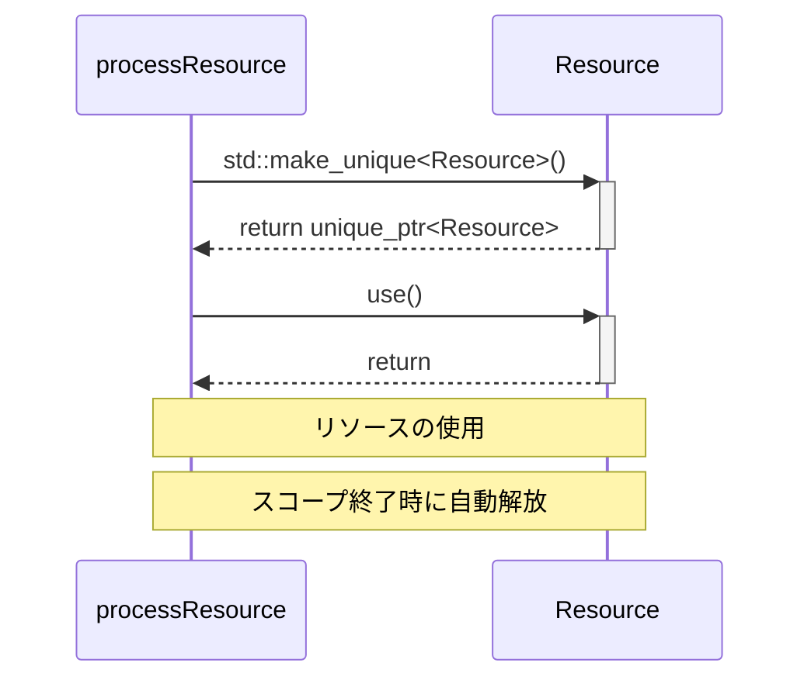

```mermaid
sequenceDiagram
    participant P as processResource
    participant R as Resource

    P->>+R: std::make_unique<Resource>()
    R-->>-P: return unique_ptr<Resource>
    P->>+R: use()
    R-->>-P: return
    Note over P,R: リソースの使用
    Note over P,R: スコープ終了時に自動解放
```