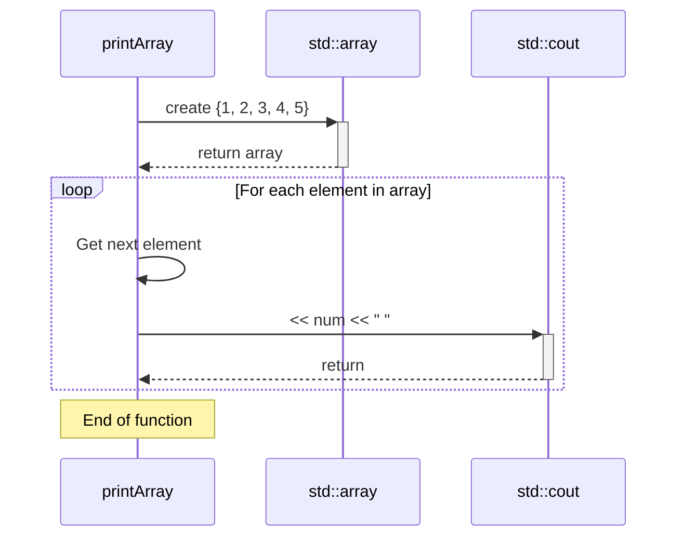

```mermaid
sequenceDiagram
    participant P as printArray
    participant A as std::array
    participant C as std::cout

    P->>+A: create {1, 2, 3, 4, 5}
    A-->>-P: return array

    loop For each element in array
        P->>P: Get next element
        P->>+C: << num << " "
        C-->>-P: return
    end

    Note over P: End of function
```