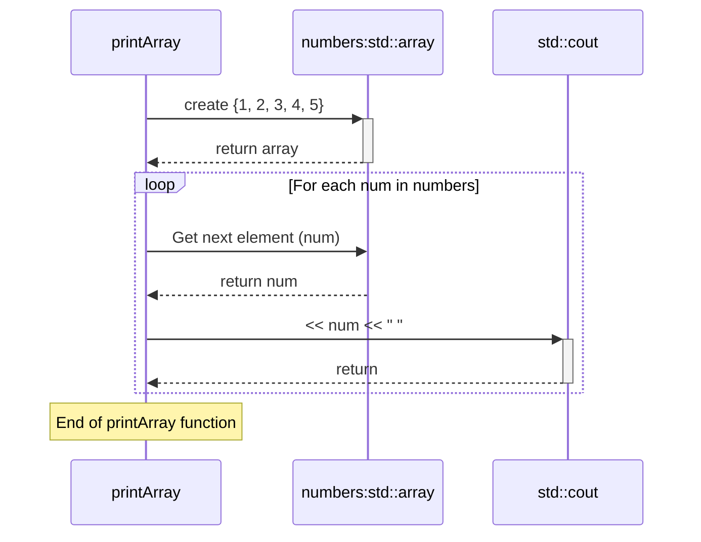

```mermaid
sequenceDiagram
    participant P as printArray
    participant N as numbers:std::array
    participant C as std::cout

    P->>+N: create {1, 2, 3, 4, 5}
    N-->>-P: return array

    loop For each num in numbers
        P->>N: Get next element (num)
        N-->>P: return num
        P->>+C: << num << " "
        C-->>-P: return
    end

    Note over P: End of printArray function
```