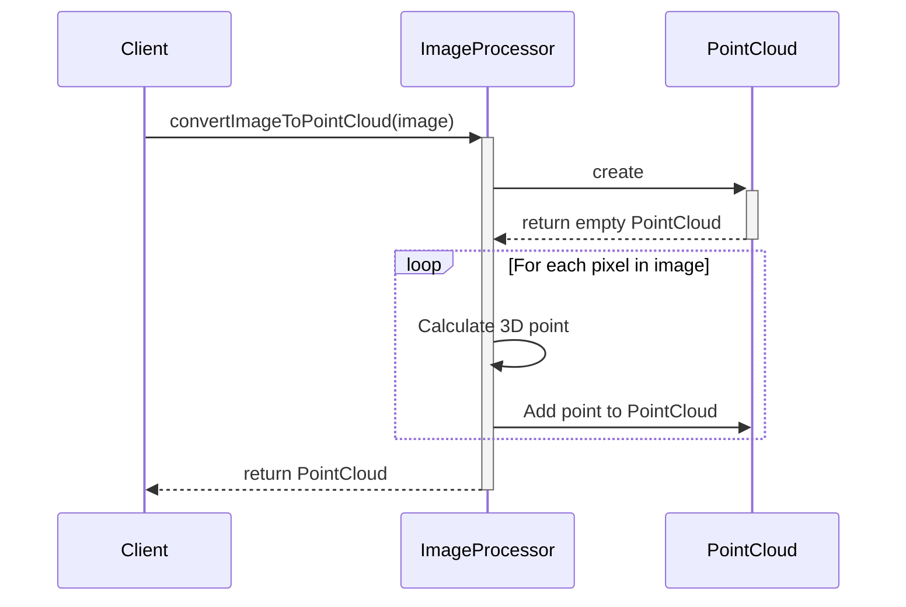

```mermaid
sequenceDiagram
    participant C as Client
    participant IP as ImageProcessor
    participant PC as PointCloud

    C->>+IP: convertImageToPointCloud(image)
    IP->>+PC: create
    PC-->>-IP: return empty PointCloud
    loop For each pixel in image
        IP->>IP: Calculate 3D point
        IP->>PC: Add point to PointCloud
    end
    IP-->>-C: return PointCloud

```